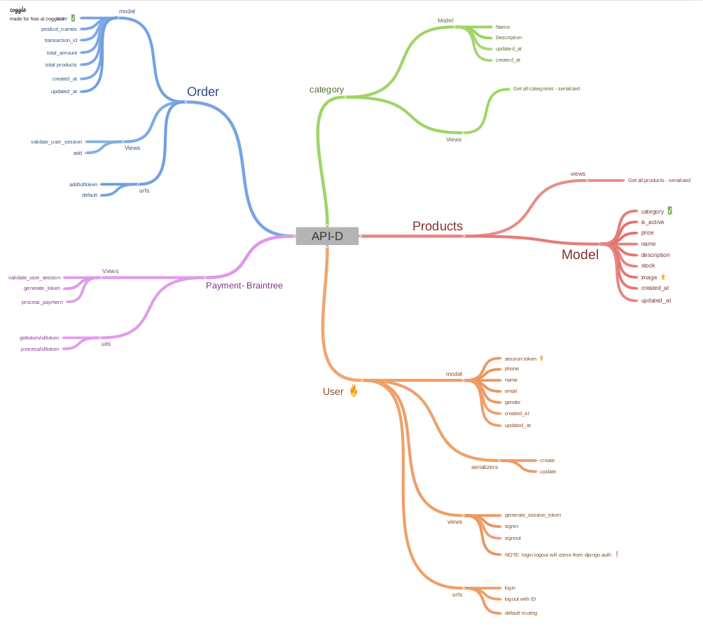

# Apni-Dukaan

Apni Dukan is E-commerce website that I am developing for a local clothing store.

## Motivation
I developed a keen interest in making things work using python. So, I started learning django for web developmet. In my opinion, project-based learning is the best way to get started.
 
So, I started working on an actual problem statement for a local vendor.
Till now, I have learnt few concepts of django. And so, this project is in development stage.

## Build status
Rest API for handling backend is ready and tested. Currently working on React front end to consume that API.
 

## Backend Connection using API

 

## Tech/framework used:

1. FrontEnd: [React](https://reactjs.org/) (Under Development)
2. BackeEnd: [Django Rest](https://www.django-rest-framework.org/) (API is developed & tested)
3. Payment Gateway: [Braintree](https://developers.braintreepayments.com/)
4. API Testing: [Postman](https://www.postman.com/)

